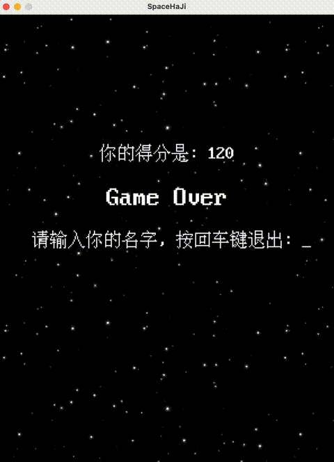

# SpaceHaJi

  

	

  
  
  
  
  

**SpaceHaJi**🚀是一款使用`SDL2`构建的太空抽象风格纵版射击游戏，你将驾驶**哈基蟹**🦀穿梭星际，迎战源源不断的**蜘蛛耄耋**🕷️和**曼波**，并收集 **Buff**，快来体验紧张刺激的哈基太空大冒险吧！

- 📝：该项目启发自**申子宇**教授的"[C++游戏开发之旅](https://cppgamedev.top/)"，本人之前并未接触过游戏设计，**SpaceHaJi**基于申教授的项目进行了框架重构。

## 画面展示

  
  
  

## 游戏玩法

- **启动**：在标题界面按 `J` 键进入游戏。
- **移动**：`W/A/S/D` 控制**哈基蟹**🦀上下左右移动。
- **攻击**：按住 `Space` 发射**圆头耄耋**，拾取喷射器后可发射火箭弹。
- **增益道具**：
  - `Life`：回复生命值。
  - `Shield`：生成临时护盾，抵挡**蜘蛛耄耋**和**曼波**的生化攻击🐍。
  - `Time`：召唤喷射器并强化火力。
- **失败条件**：生命归零后7s进入结算界面，期间有**劳大彩蛋**🥚。

## 游戏环境

- **C++17**编译器(GCC、Clang或MSVC)。
- **CMake**构建工具(version ≥ 3.10)。
- **SDL2**基础库：`SDL2`, `SDL2_image`, `SDL2_mixer`, `SDL2_ttf`。
  - **SDL2**基础环境安装可以参考该文档：[环境配置说明](https://cppgamedev.top/courses/sdl-space-shooter/parts/environment-setup)
- **快速开始：**
  - **克隆仓库**：`git clone https://github.com/HarveyJae/SpaceHaJi.git && cd SpaceHaJi`
  - **构建项目**：`mkdir -p build && cd build && cmake ..`
  - **编译项目**：`make -j`
  - **运行项目**：`cd .. && cd bin && ./SpaceHaJi_$(uname -s)`

## 贡献

- 欢迎**Issue**、**PR**与建议，共建更有趣的太空哈基咪：
  1. 本地完成开发后请确认可编译。
  2. 请在 `assets` 内新增资源时同步更新资源引用路径。
  3. 提交PR前建议附上变更概述、测试方式与相关截图/录屏。
- 感谢🙏**申子宇教授**慷慨的发布高质量的教学资源(见下链接🔗)

  

## License

<pre>
MIT License 
Copyright (c) 2025 HarveyJae 
Permission is hereby granted, free of charge, to any person obtaining a copy
of this software and associated documentation files (the "Software"), to deal
in the Software without restriction, including without limitation the rights to
use, copy, modify, merge, publish, distribute, sublicense, and/or sell copies of
the Software, and to permit persons to whom the Software is furnished to do so,
subject to the following conditions: 
The above copyright notice and this permission notice shall be included in
all copies or substantial portions of the Software.
</pre>
