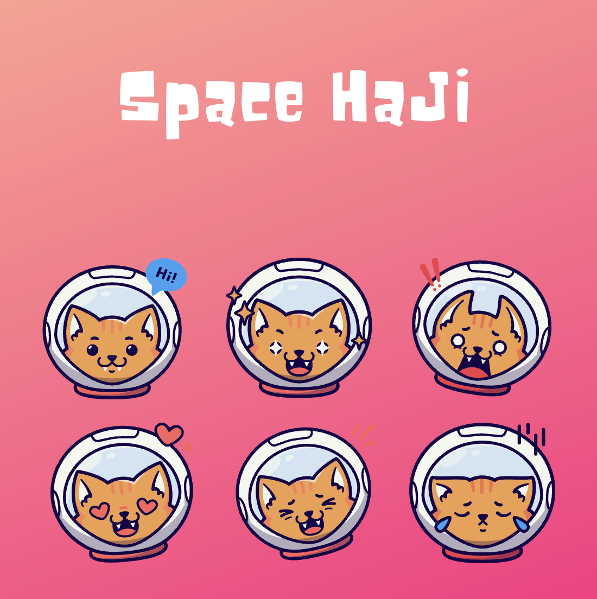

# SpaceHaJi

  
    
  

  
  
  
  
  

**SpaceHaJi**🚀是一款使用`SDL2`构建的太空抽象风格纵版射击游戏，你将驾驶**哈基蟹**🦀穿梭星际，迎战源源不断的**蜘蛛耄耋**🕷️和**曼波**，并收集 **Buff**，快来体验紧张刺激的哈基太空大冒险吧！

- 📝：该项目启发自**申子宇**教授的"[C++游戏开发之旅](https://cppgamedev.top/)"，本人之前并未接触过游戏设计，**SpaceHaJi**基于申教授的项目进行了框架重构。

## 画面展示

  

## 游戏玩法

- **启动**：在标题界面按 `J` 键进入游戏。
- **移动**：`W/A/S/D` 控制**哈基蟹**🦀上下左右移动。
- **攻击**：按住 `Space` 发射**圆头耄耋**，拾取喷射器后可发射火箭弹。
- **增益道具**：
  - `Life`：回复生命值。
  - `Shield`：生成临时护盾，抵挡**蜘蛛耄耋**和**曼波**的生化攻击🐍。
  - `Time`：召唤喷射器并强化火力。
- **失败条件**：生命归零后7s进入结算界面，期间有**劳大彩蛋**🥚。

## 游戏环境

- **C++17**编译器(GCC、Clang或MSVC)。
- **CMake**构建工具(version ≥ 3.10)。
- **SDL2**基础库：`SDL2`, `SDL2_image`, `SDL2_mixer`, `SDL2_ttf`。
  - **SDL2**基础环境安装可以参考该文档：[环境配置说明](https://cppgamedev.top/courses/sdl-space-shooter/parts/environment-setup)
- **快速开始：**
  - **克隆仓库**：`git clone https://github.com/HarveyJae/SpaceHaJi.git && cd SpaceHaJi`
  - **构建项目**：`mkdir -p build && cd build && cmake ..`
  - **编译项目**：`make -j`
  - **运行项目**：`cd .. && cd bin && ./SpaceHaJi_$(uname -s)`

## 贡献

- 欢迎**Issue**、**PR**与建议，共建更有趣的太空哈基咪：
  1. 本地完成开发后请确认可编译。
  2. 请在 `assets` 内新增资源时同步更新资源引用路径。
  3. 提交PR前建议附上变更概述、测试方式与相关截图/录屏。
- 感谢🙏**申子宇教授**慷慨的发布高质量的教学资源(见下链接🔗)

  

